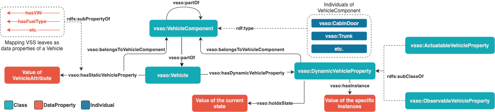

# Proposal for an evolving Vehicle Signal Specification Ontology (VSSo)

This repository contains a proposal for possible next steps in the development of the Vehicle Signal Specification Ontology (VSSo).
The implementation is part of the paper titled [An evolving Ontology for Vehicle Signals](http://dx.doi.org/10.13140/RG.2.2.14695.78240) submitted to
the Recent Results Track of 2021 IEEE 93rd Vehicular Technology Conference: VTC2021-Spring, Helsinki.

The current status of VSSo can be found [here](https://github.com/w3c/vsso).

## Background

In the paper, we propose a core ontology for vehicle signals based on the concept you find in
the [Vehicle Signal Specification (VSS)](https://github.com/GENIVI/vehicle_signal_specification).
Based on the core ontology, the concepts are automatically generated through an extension of
the [VSS Tools](https://github.com/GENIVI/vss-tools). The concepts of the ontology are as described
in the following figure:



## Content

1. The examples folder consists of a jupyter notebook, which generates a `.ttl` file with a sample vehicles.
1. The ontology folder holds the latest `vsso_latest.ttl` file generated by the tools.

## Generator

The generator of the `.ttl` file resides in a different repository. The following steps have to be followed:

1. Clone the [Vehicle Signal Specification (VSS)](https://github.com/GENIVI/vehicle_signal_specification)
1. Point the submodule for vss-tools to the [vsso-tools](https://github.com/danielwilms/vsso-tools) repository and pull its main branch
1. Generate the `.ttl`, by running:
   ```bash
       vss-tools/vspec2ttl.py -i:spec/VehicleSignalSpecification.id -I ./spec ./spec/VehicleSignalSpecification.vspec vsso_latest.ttl
   ```
